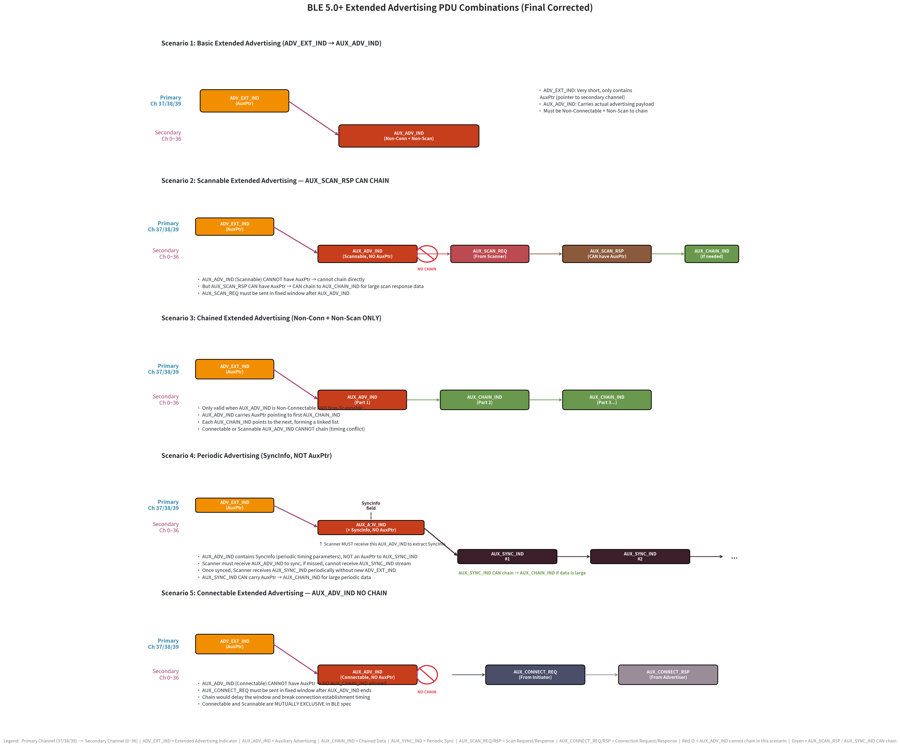
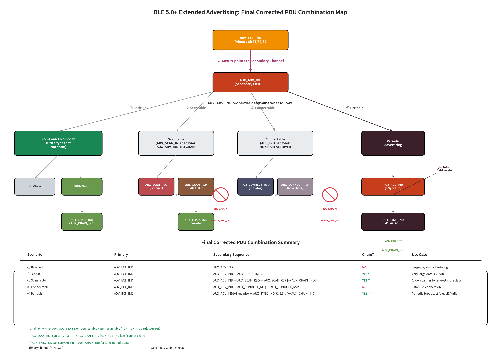

# BLE 5.0+ 扩展广播（Extended Advertising）PDU 组合与使用场景详解

> 本文整理自对 BLE 5.0+ Extended Advertising PDU 使用场景的深入讨论，涵盖所有合法的 PDU 组合、时序关系以及常见误区。

---

## 一、四种核心 PDU

| PDU | 发送信道 | 作用 |
|-----|---------|------|
| **ADV_EXT_IND** | Primary (37/38/39) | 极短，仅含 **AuxPtr**（指向 Secondary 信道的指针） |
| **AUX_ADV_IND** | Secondary (0~36) | 承载**实际的广播数据** |
| **AUX_SYNC_IND** | Secondary (0~36) | **周期性广播**，建立同步后周期性发送 |
| **AUX_CHAIN_IND** | Secondary (0~36) | **链式传输**，数据超长时继续拼接 |

**核心设计思想**：ADV_EXT_IND 只在 Primary 信道发一个"指针"，真正的数据都在 Secondary 信道上，避免 Primary 信道拥塞。

---

## 二、五大使用场景时序图

### 场景 ①：基础扩展广播

```
ADV_EXT_IND (Primary) → AUX_ADV_IND (Secondary)
```

- **AUX_ADV_IND 属性**：Non-Connectable + Non-Scannable
- **用途**：普通的大数据量广播
- ADV_EXT_IND 只有几个字节，AUX_ADV_IND 可携带最多 **255 字节** 数据（Legacy 仅 31 字节）

### 场景 ②：可扫描广播（Scannable）

```
ADV_EXT_IND → AUX_ADV_IND → AUX_SCAN_REQ → AUX_SCAN_RSP [→ AUX_CHAIN_IND...]
```

- **AUX_ADV_IND 属性**：Scannable
- **关键规则**：
  - AUX_ADV_IND（Scannable）**不能**携带 AuxPtr，因此 AUX_ADV_IND 本身**不能直接 chain**
  - 但 **AUX_SCAN_RSP 可以**携带 AuxPtr，进而指向 AUX_CHAIN_IND 继续传输大数据
- **用途**：Scanner 想获取更多数据时主动请求，全部在 Secondary 信道完成

### 场景 ③：链式广播（大数据）

```
ADV_EXT_IND → AUX_ADV_IND → AUX_CHAIN_IND → AUX_CHAIN_IND → ...
```

- **AUX_ADV_IND 属性**：**必须是 Non-Connectable + Non-Scannable**
- **用途**：数据超过 AUX_ADV_IND 能承载的上限
- 每个 AUX_CHAIN_IND 里都有指向下一个的指针，形成**链表**
- **Connectable 或 Scannable 的 AUX_ADV_IND 不能 chain**（时序冲突）

### 场景 ④：周期性广播（Periodic Advertising）

```
ADV_EXT_IND → AUX_ADV_IND(+SyncInfo) → AUX_SYNC_IND #1 → AUX_SYNC_IND #2 → ...
```

- **AUX_ADV_IND 属性**：Periodic Advertising 相关
- **关键规则**：
  - AUX_ADV_IND 包含 **SyncInfo 字段**（周期性同步参数：间隔、时钟精度、信道映射等）
  - **SyncInfo 不是 AuxPtr**！AUX_ADV_IND **不通过 AuxPtr 指向 AUX_SYNC_IND**
  - Scanner **必须收到 AUX_ADV_IND** 才能提取 SyncInfo；如果错过，就无法同步到后续的 AUX_SYNC_IND 流
  - 一旦 Scanner 拿到 SyncInfo，就能独立地、周期性地接收 AUX_SYNC_IND，**不再需要新的 ADV_EXT_IND** 引导
  - **AUX_SYNC_IND 可以携带 AuxPtr → AUX_CHAIN_IND**，用于传输超长的周期性数据（如 LE Audio）
- **用途**：单向周期性广播，不需要连接

### 场景 ⑤：可连接广播（Connectable）

```
ADV_EXT_IND → AUX_ADV_IND → AUX_CONNECT_REQ → AUX_CONNECT_RSP
```

- **AUX_ADV_IND 属性**：Connectable
- **关键规则**：
  - AUX_ADV_IND（Connectable）**不能携带 AuxPtr**，因此**不能 chain**
  - AUX_CONNECT_REQ 必须在 AUX_ADV_IND 结束后的**固定时间窗口**内发送，chain 会破坏连接时序
- **用途**：建立连接，连接建立过程在 Secondary 信道完成

---

## 三、完整场景时序图



> 图中 **红色禁止符号 (⊘)** 表示该场景下 AUX_ADV_IND 不能 Chain；绿色箭头表示 AUX_SCAN_RSP / AUX_SYNC_IND 可以 Chain。

---

## 四、PDU 组合汇总



### 组合汇总表

| 组合 | AUX_ADV_IND 属性 | Secondary 信道完整序列 | 允许 Chain? | 典型用途 |
|------|------------------|----------------------|------------|---------|
| ① 基础广播 | Non-Conn + Non-Scan | `AUX_ADV_IND` | ❌ | 普通大数据广播 |
| ①+Chain | Non-Conn + Non-Scan | `AUX_ADV_IND → AUX_CHAIN_IND...` | ✅* | 超长数据 (>255B) |
| ② 可扫描 | Scannable | `AUX_ADV_IND → AUX_SCAN_REQ → AUX_SCAN_RSP [→ AUX_CHAIN_IND]` | ✅** | Scanner 请求更多数据 |
| ③ 可连接 | Connectable | `AUX_ADV_IND → AUX_CONNECT_REQ → AUX_CONNECT_RSP` | ❌ | 建立连接 |
| ④ 周期广播 | Periodic | `AUX_ADV_IND(+SyncInfo) → AUX_SYNC_IND #1,2,3... [→ AUX_CHAIN_IND]` | ✅*** | 周期性单向广播（如 LE Audio） |

> **\*** Chain 仅当 AUX_ADV_IND 为 **Non-Connectable + Non-Scannable** 时允许（AUX_ADV_IND 自身携带 AuxPtr）  
> **\*\*** AUX_SCAN_RSP **可以**携带 AuxPtr → AUX_CHAIN_IND（AUX_ADV_IND 本身不能 chain）  
> **\*\*\*** AUX_SYNC_IND **可以**携带 AuxPtr → AUX_CHAIN_IND，用于传输超长的周期性数据

---

## 五、关键设计思想与常见误区

### 设计思想

1. **Primary 信道只发"指针"**：ADV_EXT_IND 极短，Primary 信道（37/38/39）不再被大数据广播堵塞
2. **Secondary 信道做所有重活**：数据、扫描响应、连接建立、周期性同步都在 Secondary 完成
3. **AUX_CHAIN_IND 是链表结构**：每个节点指向下一个，理论上可以传非常大的数据
4. **AUX_SYNC_IND 是"订阅制"**：Scanner 通过 SyncInfo 订阅后，后续不再需要 ADV_EXT_IND 引导

### 常见误区

| 误区 | 正确理解 |
|------|---------|
| "Scannable 场景完全不能 chain" | AUX_ADV_IND 不能 chain，但 **AUX_SCAN_RSP 可以 chain** |
| "Connectable 场景可以 chain 后再连接" | **Connectable 的 AUX_ADV_IND 完全不能 chain**，连接时序固定 |
| "Periodic 场景 AUX_ADV_IND 用 AuxPtr 指向 AUX_SYNC_IND" | AUX_ADV_IND 用 **SyncInfo 字段**（不是 AuxPtr）传递同步参数 |
| "Connectable + Scannable 可以同时存在" | **这两个属性互斥**，BLE 规范不允许同时设置 |

---

## 六、修正记录

| 轮次 | 修正内容 |
|------|---------|
| 第 1 轮 | 初始版本，错误地认为 Connectable 和 Scannable 场景下 AUX_ADV_IND 可以 chain |
| 第 2 轮 | 修正：Connectable 和 Scannable 的 AUX_ADV_IND 不能 chain；Periodic 场景 SyncInfo 不是 AuxPtr；AUX_SYNC_IND 可以 chain |
| 第 3 轮 | 修正：AUX_SCAN_RSP **可以** chain；删除不存在的 "Connectable + Scannable" 组合 |

---

*本文档由 AI 辅助整理，经人工审核确认技术细节。*
